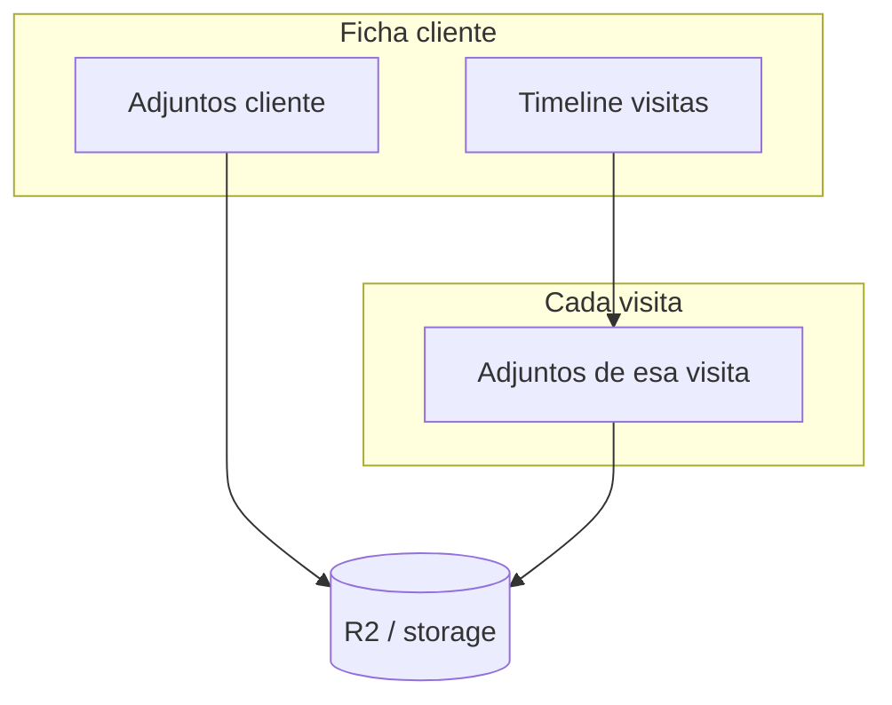

# Archivos en ficha de cliente — guía completa para frontend

Documento índice de todo lo implementado en el backend sobre **carga, listado, descarga y eliminación de archivos** en el módulo de clientes.

**Base URL:** `/api` (local: `http://localhost:3001/api`)

**Documentación detallada por módulo:**

- [FRONTEND_ADJUNTOS_CLIENTES.md](./FRONTEND_ADJUNTOS_CLIENTES.md) — archivos del cliente (carpeta general)
- [FRONTEND_ADJUNTOS_VISITAS.md](./FRONTEND_ADJUNTOS_VISITAS.md) — archivos por visita (timeline)
- [openapi.yaml](./openapi.yaml) — schemas `CustomerAttachment`, `CustomerVisit`, `CustomerVisitAttachment`

---

## Resumen ejecutivo

Hay **dos tipos de adjuntos**, con reglas iguales (tipos MIME, 10 MB, descarga con JWT) pero **distinta asociación**:

| Concepto | ¿A qué pertenece? | ¿Cuántos archivos? | Cómo se listan |
|----------|-------------------|--------------------|----------------|
| **Adjuntos de cliente** | El cliente (ficha general) | Varios | `GET .../attachments` |
| **Adjuntos de visita** | Una visita/nota del timeline | Varios por visita | Embebidos en `GET .../visits` → `attachments[]` |



**No existe** un endpoint `/timeline` unificado. El front arma el timeline con `GET .../visits` (cada visita ya trae sus archivos). Opcionalmente puede mezclar también adjuntos de cliente ordenando por fecha en UI.

---

## Mapa de endpoints

### Visitas (texto + timeline)

| Método | Ruta | Auth | RBAC |
|--------|------|------|------|
| `GET` | `/customers/:customerId/visits` | Opcional | — |
| `POST` | `/customers/:customerId/visits` | JWT | `customers.create` |

`POST` body JSON: `{ descripcion, fecha? }`. Respuesta incluye `attachments: []`.

### Adjuntos por visita

| Método | Ruta | Auth | RBAC |
|--------|------|------|------|
| `GET` | `/customers/:customerId/visits/:visitId/attachments` | Opcional | — |
| `POST` | `/customers/:customerId/visits/:visitId/attachments` | JWT | `customers.create` |
| `GET` | `.../attachments/:attachmentId/download` | JWT | `customers.read` |
| `DELETE` | `.../attachments/:attachmentId` | JWT | `customers.delete` |

### Adjuntos por cliente

| Método | Ruta | Auth | RBAC |
|--------|------|------|------|
| `GET` | `/customers/:customerId/attachments` | Opcional | — |
| `POST` | `/customers/:customerId/attachments` | JWT | `customers.create` |
| `GET` | `/customers/:customerId/attachments/:attachmentId/download` | JWT | `customers.read` |
| `DELETE` | `/customers/:customerId/attachments/:attachmentId` | JWT | `customers.delete` |

Todos los `:id` son UUID.

---

## Reglas comunes (ambos tipos)

### Tipos de archivo

Validación por **magic bytes** en backend (la extensión del nombre no basta).

| Categoría | Formatos |
|-----------|----------|
| Imagen | JPEG, PNG, WebP, GIF |
| PDF | `.pdf` |
| Word | `.doc`, `.docx` |
| Excel | `.xls`, `.xlsx` |

### Límite

**10 MB** por archivo. Conviene validar en front antes de subir.

### Upload

- `Content-Type: multipart/form-data`
- Campo obligatorio: **`file`**
- Campo opcional: **`descripcion`** (máx. 500 caracteres)
- **No** poner `Content-Type: application/json` en el header del upload
- **Un archivo por request** — para varios archivos, repetir `POST`

### Imágenes

El backend comprime con sharp (~2048 px, calidad ~80). Puede cambiar el MIME guardado (p. ej. PNG → WebP/JPEG). Mostrar `originalSizeBytes` vs `storedSizeBytes` si quieren reflejar ahorro.

### Descarga

El bucket es **privado**. Siempre descargar vía API con JWT:

```typescript
async function downloadFile(url: string, token: string, filename: string) {
  const res = await fetch(url, {
    headers: { Authorization: `Bearer ${token}` },
    redirect: 'follow',
  });
  if (!res.ok) throw new Error('No se pudo descargar');
  const blob = await res.blob();
  const objectUrl = URL.createObjectURL(blob);
  const a = document.createElement('a');
  a.href = objectUrl;
  a.download = filename;
  a.click();
  URL.revokeObjectURL(objectUrl);
}
```

Usar el campo **`downloadPath`** de la respuesta (ruta relativa, ej. `/api/customers/.../download`).

| Entorno | Comportamiento |
|---------|----------------|
| Producción (R2) | `302` → URL firmada (~5 min) |
| Local dev | `200` con el archivo en el body |

**Preview de imágenes:** `GET` con `Accept: application/json` devuelve `{ url }`. También `?inline=1` en la URL de descarga.

### Errores frecuentes

| HTTP | Cuándo |
|------|--------|
| `401` | Sin token |
| `403` | Sin permiso RBAC |
| `422` | Tipo no permitido, vacío, o > 10 MB |
| `404` | Cliente, visita o adjunto no existe; o archivo huérfano en storage |
| `503` | Storage R2 no configurado (producción) |

---

## Flujos recomendados en UI

### A) Timeline de visitas con archivos

```
1. Usuario escribe nota (+ fecha opcional)
2. POST /customers/:id/visits  →  visitId
3. Si eligió archivos:
     por cada File → POST .../visits/:visitId/attachments
4. Refrescar timeline: GET .../visits
   (cada visita trae attachments[] listo para pintar)
```

**Agregar archivos después:** mismo `POST .../visits/:visitId/attachments` sobre visita existente (modal “editar” / “añadir archivo”).

**Quitar archivo:** `DELETE .../visits/:visitId/attachments/:attachmentId`.

### B) Carpeta de documentos del cliente

```
1. GET .../attachments  →  lista paginada
2. Upload: POST .../attachments  (FormData)
3. Descarga / eliminación con downloadPath
```

### C) Crear visita + archivos en un solo paso (UI)

El backend son **2 pasos**; el front puede unificarlos:

```typescript
async function createVisitWithFiles(
  customerId: string,
  token: string,
  descripcion: string,
  files: File[],
  fecha?: string
) {
  const visitRes = await fetch(`/api/customers/${customerId}/visits`, {
    method: 'POST',
    headers: {
      'Content-Type': 'application/json',
      Authorization: `Bearer ${token}`,
    },
    body: JSON.stringify({ descripcion, ...(fecha && { fecha }) }),
  });
  if (!visitRes.ok) throw await visitRes.json();
  const visit = await visitRes.json();

  for (const file of files) {
    const form = new FormData();
    form.append('file', file);
    const up = await fetch(
      `/api/customers/${customerId}/visits/${visit.id}/attachments`,
      { method: 'POST', headers: { Authorization: `Bearer ${token}` }, body: form }
    );
    if (!up.ok) throw await up.json();
  }

  return visit;
}
```

---

## Formas de respuesta

### Visita con adjuntos (`GET .../visits`)

```json
{
  "data": {
    "data": [
      {
        "id": "uuid-visita",
        "customerId": "uuid-cliente",
        "fecha": "2026-06-21T15:00:00.000Z",
        "descripcion": "Texto de la nota",
        "createdAt": "...",
        "updatedAt": "...",
        "usuario": { "nombre": "...", "username": "..." },
        "attachments": [
          {
            "id": "uuid-adjunto",
            "visitId": "uuid-visita",
            "originalName": "foto.jpg",
            "mimeType": "image/jpeg",
            "originalSizeBytes": 500000,
            "storedSizeBytes": 80000,
            "descripcion": null,
            "createdAt": "...",
            "uploadedBy": { "nombre": "...", "username": "..." },
            "downloadPath": "/api/customers/{customerId}/visits/{visitId}/attachments/{id}/download"
          }
        ]
      }
    ],
    "pagination": { "page": 1, "pageSize": 20, "total": 1, "totalPages": 1 }
  }
}
```

### Adjunto de cliente (`GET .../attachments` o `POST` upload)

```json
{
  "id": "uuid",
  "customerId": "uuid-cliente",
  "originalName": "contrato.pdf",
  "mimeType": "application/pdf",
  "originalSizeBytes": 120000,
  "storedSizeBytes": 120000,
  "descripcion": "Contrato 2026",
  "createdAt": "...",
  "uploadedBy": { "nombre": "...", "username": "..." },
  "downloadPath": "/api/customers/{customerId}/attachments/{id}/download"
}
```

La envoltura de listados paginados sigue el estándar del proyecto (`data` + `pagination` dentro de la respuesta `ok`).

---

## Tipos TypeScript (copiar al front)

```typescript
export interface UploadedBy {
  nombre: string;
  username: string;
}

export interface CustomerAttachment {
  id: string;
  customerId: string;
  originalName: string;
  mimeType: string;
  originalSizeBytes: number;
  storedSizeBytes: number;
  descripcion: string | null;
  createdAt: string;
  uploadedBy: UploadedBy;
  downloadPath: string;
}

export interface CustomerVisitAttachment {
  id: string;
  visitId: string;
  originalName: string;
  mimeType: string;
  originalSizeBytes: number;
  storedSizeBytes: number;
  descripcion: string | null;
  createdAt: string;
  uploadedBy: UploadedBy;
  downloadPath: string;
}

export interface CustomerVisit {
  id: string;
  customerId: string;
  fecha: string;
  descripcion: string;
  createdAt: string;
  updatedAt: string;
  usuario: UploadedBy;
  attachments: CustomerVisitAttachment[];
}

export interface Paginated<T> {
  data: T[];
  pagination: {
    page: number;
    pageSize: number;
    total: number;
    totalPages: number;
  };
}
```

---

## Permisos RBAC

Todo usa el recurso **`customers`** existente:

| Acción | Permiso |
|--------|---------|
| Crear visita / subir archivo | `customers.create` |
| Descargar | `customers.read` |
| Eliminar adjunto | `customers.delete` |
| Listar | Sin auth obligatoria (optionalAuth) |

Ocultar botones de upload/delete según permisos del usuario logueado.

---

## Checklist de integración

- [ ] Input `type="file"` con `accept` razonable (validación final en backend)
- [ ] Validar ≤ 10 MB antes de `POST`
- [ ] Upload con `FormData`; **no** setear `Content-Type` manualmente
- [ ] Visita nueva: crear JSON primero, luego N uploads si hay archivos
- [ ] Timeline: consumir `attachments[]` de `GET .../visits`
- [ ] Descarga siempre con `Authorization` + `downloadPath`
- [ ] Manejar 422 (tipo/tamaño) y 503 (storage) con mensaje al usuario
- [ ] Diferenciar en UI “documentos del cliente” vs “archivos de esta visita”

---

## Qué NO está en v1

- Upload múltiple en un solo `POST` (batch)
- `PUT/PATCH` para editar texto o fecha de una visita
- `DELETE` de visita completa
- Endpoint `/timeline` unificado
- Límite máximo de archivos por visita/cliente

---

## Changelog backend (referencia)

| Fecha | Cambio |
|-------|--------|
| v1 | Adjuntos por cliente (`CustomerAttachment`, R2/local) |
| v1.1 | Adjuntos por visita (`CustomerVisitAttachment`) |
| v1.1 | `GET .../visits` incluye `attachments[]` en cada visita |
| v1.1 | Helpers compartidos: mismos MIME, 10 MB, sharp, descarga |

---

## Preguntas frecuentes

**¿Puedo subir archivos al crear la visita en un solo request?**  
No en v1. Primero `POST` JSON de la visita, luego uno o más `POST` multipart.

**¿Los adjuntos de cliente aparecen en el timeline?**  
No automáticamente. Son listas distintas; el front puede fusionarlas en UI si lo desean.

**¿Por qué `storedSizeBytes` es menor en imágenes?**  
Compresión en backend; es esperado.

**¿Funciona sin R2 en local?**  
Sí, con `ATTACHMENTS_STORAGE=memory` en `.env` del backend (archivos en `.attachments-dev/`).
